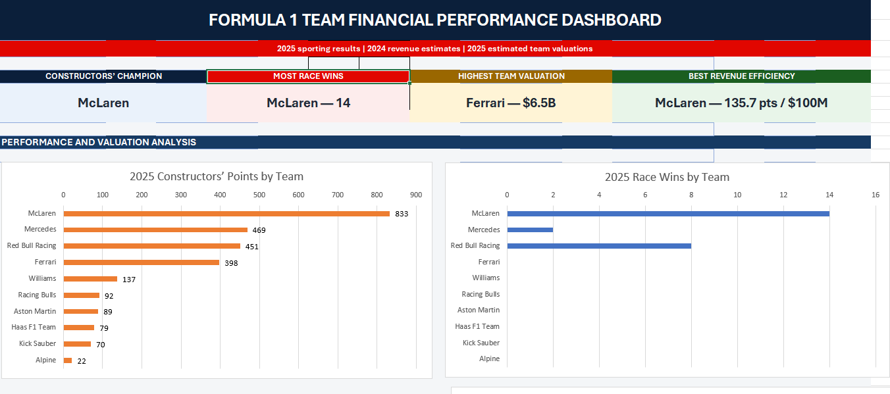

# Formula 1 Financial Performance Analysis

I built this project to improve my Excel and financial analysis skills while working with a topic I enjoy: Formula 1.

The project compares 2025 racing performance with 2024 revenue estimates and 2025 team valuations. I used Excel to organize the data, calculate performance-to-revenue metrics, and create a dashboard comparing all 10 teams.

## Dashboard Preview

The full dashboard, analysis, and supporting data are available in the project files below.

## Main Question

Which Formula 1 team achieved the strongest racing performance relative to its revenue?

## What I Analyzed

- Constructors’ Championship points
- Race wins and podiums
- Estimated team revenue
- Estimated team valuations
- Revenue per championship point
- Points earned per $100 million of revenue

## Key Findings

McLaren had the strongest racing season, scoring 833 points and earning 14 wins. It also produced approximately 135.7 championship points per $100 million of revenue, the highest result in the analysis.

Ferrari had the highest estimated valuation at $6.5 billion, despite scoring fewer points than McLaren. This suggests that a team’s value is influenced by factors such as brand recognition, history, sponsorships, and commercial strength—not only its current results.

## Tools Used

- Microsoft Excel
- Formulas and calculated metrics
- Tables and data organization
- Charts and dashboard design
- Financial and business analysis

## Limitations

The racing results are from 2025, while revenue figures represent 2024 estimates. Revenue does not represent team spending, profit, or return on investment, so the calculations only compare financial scale with racing performance.

## Project Files

- [Excel Workbook](Formula1-Team-Financial-Analysis/F1_Team_Valuation_Performance_Analysis_Final.xlsx)
- [Dashboard PDF](Formula1-Team-Financial-Analysis/F1_Financial_Performance_Dashboard.pdf)
- [Executive Summary PDF](Formula1-Team-Financial-Analysis/F1_Executive_Summary.pdf)

